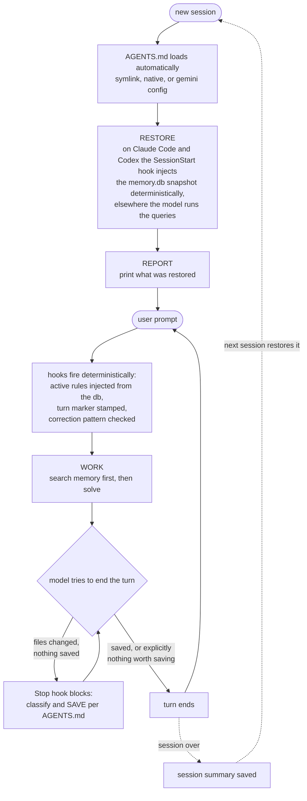

# dotagent

Persistent, branch-aware SQLite memory for AI coding agents, enforced by hooks. Works with Claude Code, Codex, Gemini CLI, and any tool that reads `AGENTS.md` natively (Amp, OpenCode, Cursor CLI, ...).

Every session starts by restoring what previous sessions knew: open tasks, known bugs, decisions, learnings, what the user was working on. Every session ends by saving what it did. One `AGENTS.md` file teaches the agent the whole cycle; one SQLite file per developer holds the memory.

## Quick start

```bash
# clone dotagent somewhere OUTSIDE your project
git clone git@github.com:arthurix/dotagent.git ~/tools/dotagent

# install for your tool, pointing at your project
~/tools/dotagent/install/claude   /path/to/my-project
~/tools/dotagent/install/codex    /path/to/my-project
~/tools/dotagent/install/opencode /path/to/my-project
~/tools/dotagent/install/gemini   /path/to/my-project
~/tools/dotagent/install/all      /path/to/my-project
```

Or in one line (clones to `~/.dotagent` and installs):

```bash
curl -fsSL https://raw.githubusercontent.com/arthurix/dotagent/master/setup.sh | bash -s -- claude /path/to/my-project
```

Open a new session in the project. The agent prints a status report of restored memory and starts working with it. That's the whole setup.

Requirements: `git`, `sqlite3`, `jq`. On Codex, review and trust the installed hooks once with `/hooks`.

## What gets installed

```
your-project/
├── AGENTS.md                  the memory contract: RESTORE, REPORT, WORK, SAVE
├── CLAUDE.md -> AGENTS.md     (claude install) symlink, Claude Code reads it
├── .claude/settings.json      (claude install) one dispatch entry per hook event
├── .codex/hooks.json          (codex install) same events through the codex adapter
├── .gemini/settings.json      (gemini install) contextFileName: AGENTS.md
└── .agent/
    ├── memory.db              YOUR memory, per developer, auto-excluded from git
    ├── init-db.sql            schema, used to (re)create memory.db
    └── hooks/                 dispatch.sh plus one directory per event, tool neutral names
        ├── dispatch.sh        the only thing a tool ever wires
        ├── session-start/     memory snapshot injection
        ├── prompt-submit/     rules injection, correction capture
        ├── pre-tool/          commit, PR and code style
        ├── post-tool/         diff-based style check
        ├── stop/              save gate
        ├── session-end/       ships empty, drop a script in, it runs
        └── claude/ codex/ opencode/   per client namespaces for each full native surface
```

`.agent/rules/`, `workflows/`, `agents/` and `skills/` are optional extension points: create the directory and drop in your own md files. Rules are auto-loaded every session, agents are called with `@name`, workflows with "load <name>", skills activate when the task matches.

## How the memory works

`AGENTS.md` makes every session run this cycle:

1. **RESTORE** load rules, then query `memory.db` for the current branch: last session, open tasks, bugs, decisions, learnings, the user's diary.
2. **REPORT** print what was restored, so the human sees what the agent knows.
3. **WORK** do the task, searching prior memory before re-solving anything.
4. **SAVE** write what happened to the right table, announced, and always a session summary at the end.



The memory is scoped per feature branch across the tables `tasks`, `bugs`, `sessions`, `decisions`, `refactorings`, `learnings`, plus cross-branch `memories`, the user's `diary`, per-prompt `rules` and a `state` key-value store. The full schema and save commands live in `AGENTS.md`.

Two layers keep it deterministic: what code can enforce, hooks enforce mechanically on every event (rules injection, the save gate, commit style denial); what needs judgment is a written checklist in `AGENTS.md` the model executes. Memory lives outside the model, a session can crash or compact and the next one restores from the db and continues.

## Tool support

| | Claude Code | Codex | OpenCode | Gemini CLI |
|---|---|---|---|---|
| AGENTS.md auto-load | CLAUDE.md symlink | native | native | contextFileName |
| Memory contract (sqlite restore and save) | yes | yes | yes | yes |
| Memory load at session open | SessionStart hook | trusted SessionStart hook | model runs the queries | model runs the queries |
| `rules` rows | re-injected every prompt | re-injected every prompt | loaded at RESTORE | loaded at RESTORE |
| Save gate, feedback capture, style hooks | wired | wired via `.codex/hooks.json` | plugin, experimental | nothing wired |

Installers and hooks are exercised against throwaway git projects with real payloads, and the system is used daily on Claude Code. Codex was verified against `codex-cli 0.153.4` but not in a live session after hook trust review. OpenCode and Gemini have not been exercised end to end.

## Cost and the off switch

The restore snapshot rides with your first prompt, a few hundred tokens fresh, one to two thousand mature, and sits at the start of context where prompt caching is best. Active `rules` rows are re-injected every prompt, keep them short. Opening a session and typing nothing costs nothing, it is local sqlite until the first prompt.

When tokens matter more than memory, switch it off per project, the toggle is in `AGENTS.md` so it works in every tool:

```
dotagent off     dotagent on     dotagent status
```

On Claude Code `/dotagent` is a shipped alias. Off silences everything, the snapshot, the rules injection, the save gate, the style hooks; nothing is uninstalled, `dotagent on` restores it all.

Codex note: it caps concatenated AGENTS.md files at 32 KiB by default and this file is ~29 KiB, raise the limit in Codex config if your global AGENTS.md pushes past it.

## Memory is personal, config is shared

`memory.db` belongs to one developer, the installer git-excludes it, teammates run the installer and get their own. Everything else is plain files: commit them if the team should share one setup, or keep `.agent/` git-excluded if everyone tunes their own (then gitignore `memory.db` yourself if you commit `.agent/`).

## Customizing

| Want to change | Edit |
|---|---|
| How the agent codes | add md files to `.agent/rules/`, all auto-loaded every session |
| How memory restore/save works | `AGENTS.md` |
| Add a specialist | `.agent/agents/<name>.md` |
| Add a procedure | `.agent/workflows/<name>.md` |
| Add a capability | `.agent/skills/<name>/SKILL.md` |
| Response style injected every prompt | `rules` table in memory.db, see [hooks/README.md](hooks/README.md) |
| Add a hook | executable in `.agent/hooks/<event>/`, copyable skeleton in [hooks/README.md](hooks/README.md#writing-your-own-hook) |
| Standing AI instructions on an event | a `*.md` file in `.agent/hooks/<event>/`, no code |

## Hooks

One directory per event, linux conf.d style: `dispatch.sh <event>` runs everything executable there in lexical order, any language, and a `*.md` file is injected as instructions with no code. Six tool neutral events are the portable intersection (session-start, prompt-submit, pre-tool, post-tool, stop, session-end); the `claude/`, `codex/` and `opencode/` namespaces carry each client's extra native events, pre-created. A native event runs only in the client that emits it, no adapter can make one client fire another's events. Every event directory has its own README; the full guide with the copyable skeleton is [hooks/README.md](hooks/README.md).

## Updating

```bash
cd ~/tools/dotagent && git pull
~/tools/dotagent/install/claude /path/to/my-project
```

Re-running the installer never overwrites files you edited, it only adds new ones and refreshes `init-db.sql`. Schema changes are applied to your existing `memory.db` without touching data.

## Reset or inspect memory

```bash
sqlite3 .agent/memory.db "SELECT branch, summary FROM sessions ORDER BY started_at DESC LIMIT 5"

# start over (deletes all memory)
rm .agent/memory.db && sqlite3 .agent/memory.db < .agent/init-db.sql
```

## Uninstall

```bash
~/tools/dotagent/uninstall/claude /path/to/my-project
~/tools/dotagent/uninstall/all    /path/to/my-project
```

Removes the tool wiring. `.agent/`, `AGENTS.md` and your memory stay, delete them manually if you want them gone.

## License

MIT
